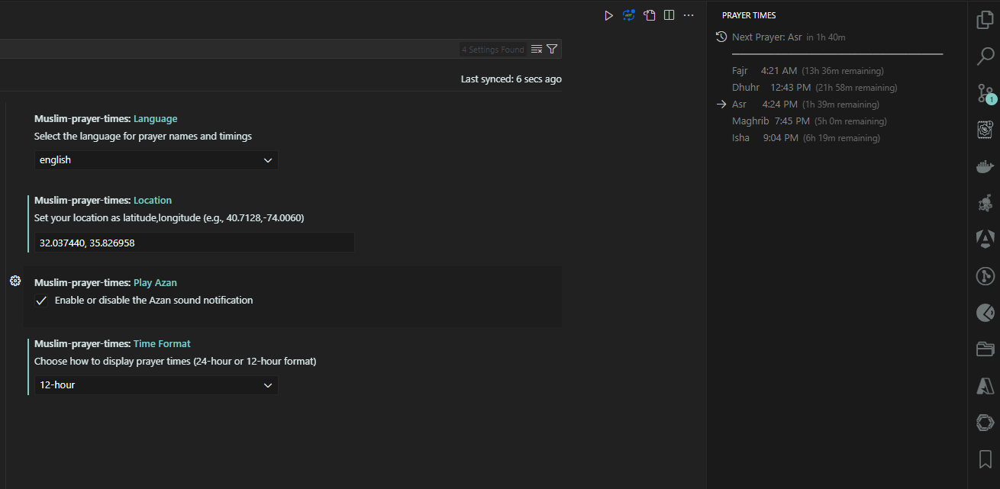

# Muslim Prayer Times Extension 

The **Muslim Prayer Times** extension for Visual Studio Code is a productivity tool designed to help Muslims keep track of their daily prayers by displaying prayer times based on the user's location. This extension provides a convenient view within the editor and offers customizable notifications to ensure that users never miss a prayer.

## Table of Contents

- [Screenshots](#screenshots)
- [Features](#features)
- [How to Use](#how-to-use)
- [Installation](#installation)
- [Contributing](#contributing)
- [License](#license)
- [Feedback](#feedback)
- [Show Your Support](#show-your-support)

## Screenshots

---

## Features

### Location-Based Prayer Times

- Fetches accurate prayer times based on the user's location.
- Users can set their location manually through the extension settings.

### Prayer Time Display

- An icon in the Primary Side Bar allows users to access the prayer times view.
- The view lists the names of the prayers along with their respective times.

### Time Remaining for Next Prayer

- Displays the time remaining until the next prayer within the prayer times view.

### 12-Hour and 24-Hour Time Formats

- Users can choose between 12-hour and 24-hour time formats for displaying prayer times.
- Configurable through the extension settings.

### Prayer Time Notifications

- Notifications appear at the time of each prayer, reminding users that it is time to pray.

### Azan Sound Notification

- Users have the option to enable or disable the Azan sound, which will play at prayer times.
- The default setting is ON.
- The Azan sound is played from an included MP3 file, providing an audible reminder for prayers.

### Language Selection

- Users can specify the language in which the names of prayers and times are displayed.
- Configurable through the extension settings.

### Easy Configuration

- The extension settings allow users to easily set their location and choose their preferred time format and notification preferences.

### Refresh Command

- A command to refresh prayer times manually is available, ensuring that users always have the latest prayer times based on their current location.

## How to Use

### Set Your Location

1. Go to the extension settings.
2. Enter your location in the format `latitude,longitude` (e.g., `40.7128,-74.0060`).

### Choose Time Format

1. Select your preferred time format (12-hour or 24-hour) from the extension settings.

### Enable/Disable Azan Sound

1. Enable or disable the Azan sound from the extension settings as per your preference.

### Access Prayer Times

1. Click on the Prayer Times icon in the Primary Side Bar to view the current prayer times.

### Manual Refresh

1. Use the `Muslim Prayer Times: Refresh Prayer Times` command from the command palette to refresh the prayer times manually.

## Installation

1. Open Visual Studio Code.
2. Go to the Extensions view by clicking on the Extensions icon in the Activity Bar on the side of the window.
3. Search for `Muslim Prayer Times`.
4. Click `Install`.
5. Access the extension settings to configure your preferences.

## Contributing

Contributions are welcome! Please fork the repository and submit a pull request with your improvements. Follow the coding standards and guidelines mentioned in the [CONTRIBUTING.md](CONTRIBUTING.md) file.

## License

This extension is licensed under the MIT License. See the [LICENSE](LICENSE) file for more details.

## Feedback

For feedback or support, please open an issue in the [GitHub repository](https://github.com/Jaber-Saed/muslim-prayer-times).

## Show Your Support

If you find this extension helpful, please give the repository a ⭐️ on GitHub! It helps others discover the project and shows your support.

---

This extension is a valuable tool for Muslims who want to ensure they are always aware of their prayer times while working in Visual Studio Code. With its customizable settings and notifications, users can stay connected to their faith and manage their time effectively.
